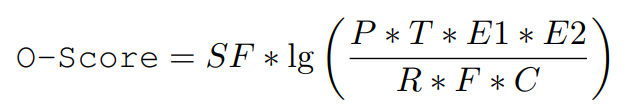
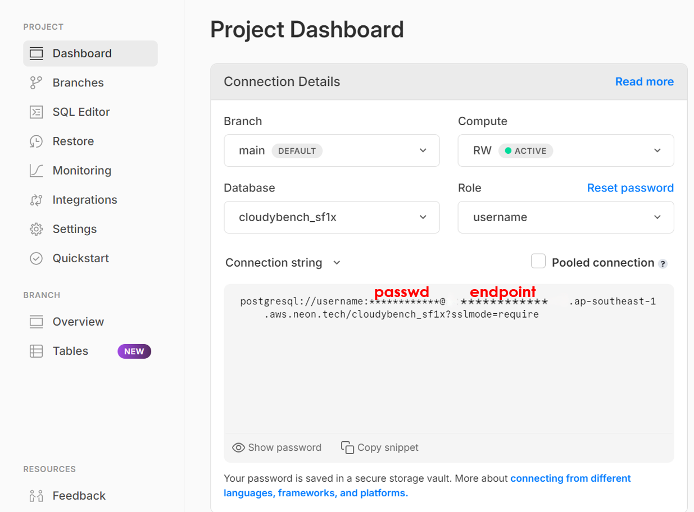
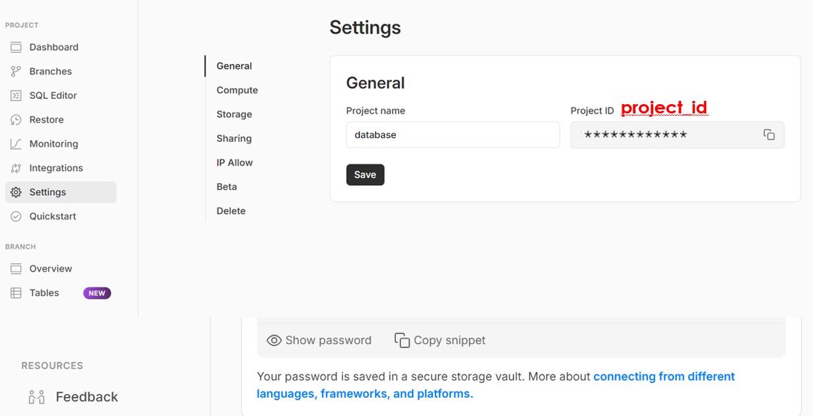
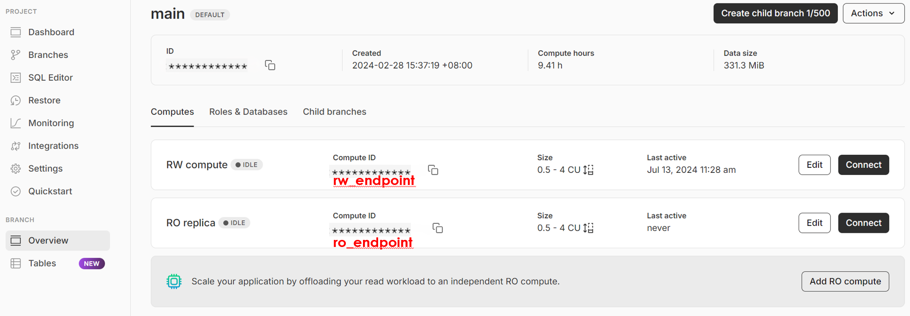
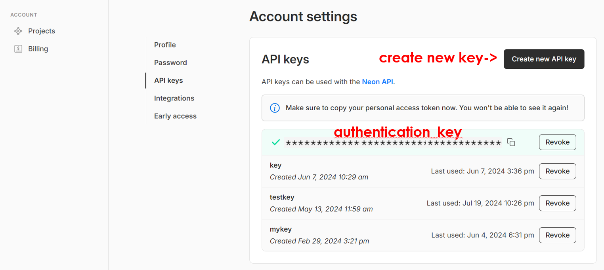

# CloudyBench - A Benchmark for Cloud-Native Databases

## Performance Metric



## Data Generation, Data Loading and Indexing
```
bash cloudybench -t sql -c conf/pg.props -f conf/ddl_cloudybench_pg.sql

bash cloudybench -t gendata -c conf/pg.props -f conf/stmt_postgres.toml

psql -h localhost -U @username -d cloudybench_sf1x -f conf/load_cloudybench_pg.sql

bash cloudybench -t sql -c conf/pg.props -f conf/create_sequence_cloudybench_pg.sql
```

## Supporting P-Score calculation as follows (Take Neon as an example):

```
bash cloudybench -t runReplica -c conf/pg.props -f conf/stmt_postgres.toml -m 1
```

## Supporting E1-Score calculation as follows:

```
bash cloudybench -t runElastic -c conf/pg.props -f conf/stmt_postgres.toml -m 1
```

## Supporting R-Score and F-Score calculation as follows:

```
bash cloudybench -t runFailOver -c conf/pg.props -f conf/stmt_postgres.toml -m 1
```

## Supporting E2-Score calculation as follows:

```
bash cloudybench -t runScaling -c conf/pg.props -f conf/stmt_postgres.toml -m 1
```

## Supporting C-Score calculation as follows:

```
bash cloudybench -t runLagTime -c conf/pg.props -f conf/stmt_postgres.toml -m 1
```

## Supporting T-Score calculation as follows:

```
bash cloudybench -t runTenancy -c conf/pg.props -f conf/stmt_postgres.toml -m 3
```

## Supporting O-Score calculation as follows:

```
bash cloudybench -t runAll -c conf/pg.props -f conf/stmt_postgres.toml
```

## Cloud-Native Database Deployment - Neon




```
cdb=neon

RW_endpoint = https://console.neon.tech/api/v2/projects/@project_id/endpoints/@rw_endpoint

RO_endpoint = https://console.neon.tech/api/v2/projects/@project_id/endpoints/@ro_endpoint

metric_url = https://console.neon.tech/api/v2/projects/@project_id/endpoints/@endpoint/stats
```

## Benchmarking Notes
(1) Error: Could not find or load main class
```
Solution: modify the path to lib directory 
```

(2) mvn clean package...Failed to execute goal on project CloudyBench:CloudyBench:jar:1.0-SNAPSHOT
```
Solution: when the Maven version is greater than 3.8, you need to remove the tags of blocked mirrors of $Maven_home/conf/settings.xml. 
```

(3) With the OS in Windows, you may use the Java command to run CloudyBench: 
```
Solution: java -cp "CloudyBench-1.0-SNAPSHOT.jar;lib/*" com.CloudyBench.CloudyBench [-t][-c][-f]
```


