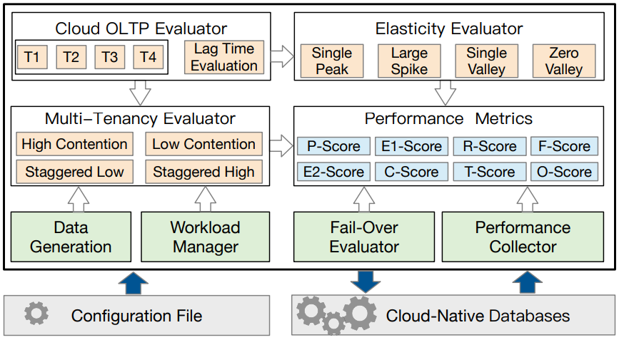

# CloudyBench - A Benchmark for Cloud-Native Databases

## CloudyBench Overview

CloudyBench is a new testbed for cloud-native databases. Its core contribution is to provide tailored workloads and metrics to evaluate the service quality of cloud-native databases in various dimensions. First, we design cloud-native workload patterns with peaks and valleys for elasticity evaluation. Second, we devise new multi-tenancy patterns by posing varied resource contention to evaluate the resource scheduling among tenants. Third, we propose a unified metric that considers performance, cost, elasticity, multi-tenancy, replication lag time, and fail-over. Fourth, we provide an evaluation testbed for evaluating cloud-native databases.


The above figure depicts an overview of CloudyBench, including the data generation, workload manager, elasticity evaluator, multi-tenancy evaluator, OLTP evaluator, fail-over evaluator, performance collector, and metrics. Given a configuration file, data is generated based on the scale factor and the workload manager spawns the workers based on the concurrency and access distribution. The workload consists of basic CRUD transactions (T1-T4), which are used to evaluate the throughput and replication lag time. They also serve as the base for generating the elasticity and multi-tenancy patterns with read and write operations. Lag time evaluation measures the replication latency. Elasticity generator will produce an elastic workload for each tenant. Multi-tenancy evaluator concurrently runs the workloads from multiple tenants. Fail-over evaluator tests the recovery speed by injecting node failures. Performance collector accumulates the performance metrics and corresponding cost.

## Performance Metrics


## Generate the Jar with maven
```
mvn clean package
```

## Data Generation, Data Loading and Indexing
```
bash cloudybench -t sql -c conf/pg.props -f conf/ddl_cloudybench_pg.sql

bash cloudybench -t gendata -c conf/pg.props -f conf/stmt_postgres.toml

psql -h localhost -U @username -d cloudybench_sf1x -f conf/load_cloudybench_pg.sql

bash cloudybench -t sql -c conf/pg.props -f conf/create_sequence_cloudybench_pg.sql
```

## Supporting P-Score calculation as follows (Take Neon as an example):

```
bash cloudybench -t runReplica -c conf/pg.props -f conf/stmt_postgres.toml -m 1
```

## Supporting E1-Score calculation as follows:

```
bash cloudybench -t runElastic -c conf/pg.props -f conf/stmt_postgres.toml -m 1
```

## Supporting R-Score and F-Score calculation as follows:

```
bash cloudybench -t runFailOver -c conf/pg.props -f conf/stmt_postgres.toml -m 1
```

## Supporting E2-Score calculation as follows:

```
bash cloudybench -t runScaling -c conf/pg.props -f conf/stmt_postgres.toml -m 1
```

## Supporting C-Score calculation as follows:

```
bash cloudybench -t runLagTime -c conf/pg.props -f conf/stmt_postgres.toml -m 1
```

## Supporting T-Score calculation as follows:

```
bash cloudybench -t runTenancy -c conf/pg.props -f conf/stmt_postgres.toml -m 3
```

## Supporting O-Score calculation as follows:

```
bash cloudybench -t runAll -c conf/pg.props -f conf/stmt_postgres.toml
```

## Cloud-Native Database Deployment - Neon


```
cdb=neon

RW_endpoint = https://console.neon.tech/api/v2/projects/@project_id/endpoints/@rw_endpoint

RO_endpoint = https://console.neon.tech/api/v2/projects/@project_id/endpoints/@ro_endpoint

metric_url = https://console.neon.tech/api/v2/projects/@project_id/endpoints/@endpoint/stats
```

## Benchmarking Notes
(1) Error: Could not find or load main class
```
Solution: modify the path to lib directory 
```

(2) mvn clean package...Failed to execute goal on project CloudyBench:CloudyBench:jar:1.0-SNAPSHOT
```
Solution: when the Maven version is greater than 3.8, you need to remove the tags of blocked mirrors of $Maven_home/conf/settings.xml. 
```

(3) With the OS in Windows, you may use the Java command to run CloudyBench: 
```
Solution: java -cp "CloudyBench-1.0-SNAPSHOT.jar;lib/*" com.cloudybench.CloudyBench [-t][-c][-f]
```


